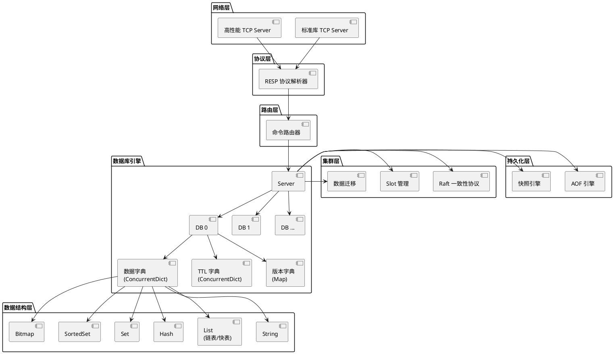
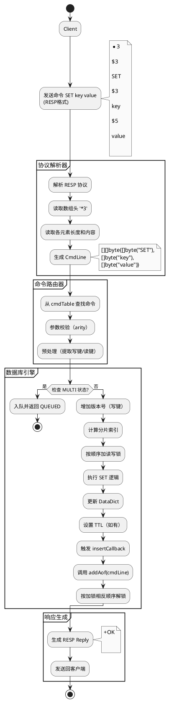
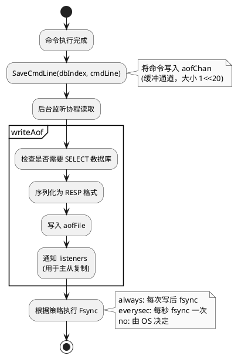
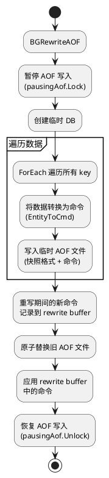
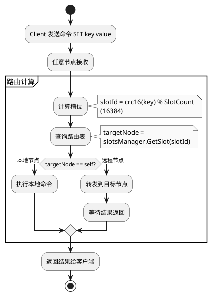
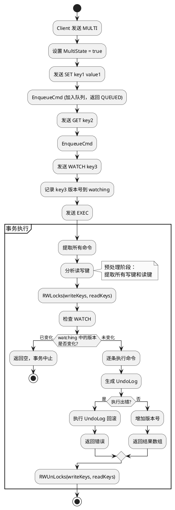
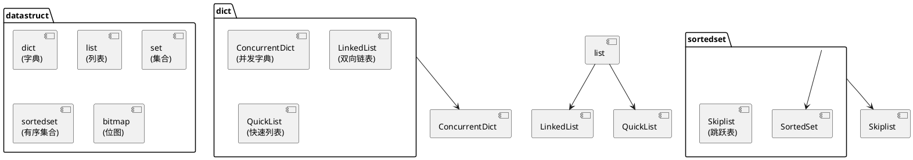
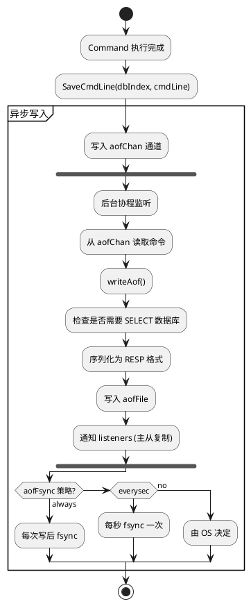
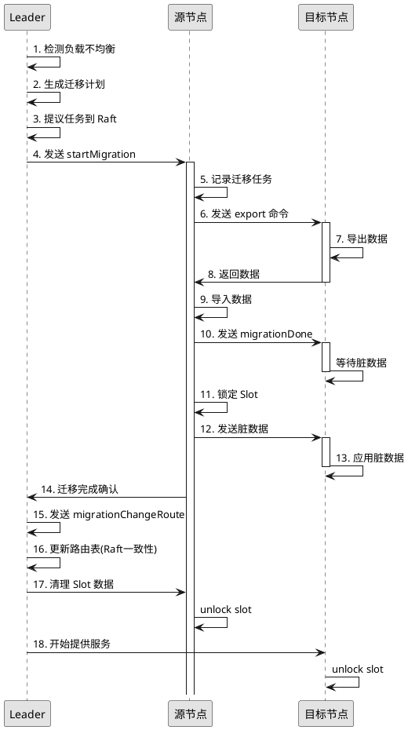

# 高性能内存缓存系统设计文档

## 1. 介绍

### 1.1. 目的

本项目旨在构建一个高性能、高可用的分布式内存缓存系统，为现代互联网应用提供亚毫秒级的数据访问能力。系统采用内存存储架构，通过高效的数据结构和算法优化，满足零信任架构下的实时访问控制、风控决策、会话管理等核心场景的性能需求。

本设计文档描述系统的整体架构、核心模块实现、对外接口以及关键技术方案，为开发团队提供详细的技术实现指导。

### 1.2. 定义和缩写

| 术语/缩写 | 定义/解释 |
|-----------|---------|
| KV Store | Key-Value 键值存储 |
| TTL | Time To Live，数据生存时间 |
| AOF | Append Only File，追加日志持久化 |
| Snapshot | 内存快照，全量持久化 |
| Raft | 分布式一致性算法 |
| RESP | 文本协议，用于客户端通信 |
| LRU | Least Recently Used，最近最少使用淘汰算法 |
| LFU | Least Frequently Used，最不经常使用淘汰算法 |
| Ziplist | 压缩列表，紧凑存储结构 |
| Skiplist | 跳跃表，有序数据结构 |

### 1.3. 参考和引用

- 分布式一致性算法：Diego Ongaro, "In Search of an Understandable Consensus Algorithm"
- 内存数据库设计：Learned et al., "Designing Distributed Systems Using Approximate Synchrony"
- 数据结构算法：Thomas H. Cormen, "Introduction to Algorithms"
- 并发控制：Maurice Herlihy, "The Art of Multiprocessor Programming"

---

# 2. 设计任务书

### 2.1 需求跟踪

| 编号 | 需求点名称 | 需求点说明/验收条件 | 自检 |
|------|-----------|------------------|------|
| 1 | 基础键值存储 | 1. 支持 String 类型的 SET/GET 操作<br>2. 支持键过期设置（TTL）<br>3. 支持批量操作（MGET/MSET）<br>4. 值最大支持 512MB | 见 3.1, 6.1 |
| 2 | 复杂数据结构 | 1. 支持 List 类型（队列操作）<br>2. 支持 Hash 类型（字段存储）<br>3. 支持 Set 类型（集合运算）<br>4. 支持 SortedSet 类型（排序集合） | 见 6.3 |
| 3 | 原子操作与事务 | 1. 支持数值原子递增/递减（INCR/DECR）<br>2. 支持事务（MULTI/EXEC）<br>3. 支持乐观锁（WATCH） | 见 6.1.3 |
| 4 | 高性能并发 | 1. QPS ≥ 100,000<br>2. P99 延迟 < 1ms<br>3. 支持 10,000 并发连接<br>4. 分片锁优化并发访问 | 见 2.2, 6.1 |
| 5 | 数据持久化 | 1. 支持 AOF 日志（everysec/always/no）<br>2. 支持快照持久化<br>3. 支持混合持久化<br>4. 支持数据恢复 | 见 4.2, 6.4 |
| 6 | 主从复制 | 1. 支持主从架构<br>2. 支持增量同步<br>3. 从节点只读<br>4. 自动故障检测 | 见 6.5 |
| 7 | 集群模式（可选） | 1. 基于一致性算法的分布式集群<br>2. 数据自动分片<br>3. 节点自动发现和故障转移 | 见 6.5 |
| 8 | 过期与淘汰 | 1. 精确到毫秒的 TTL<br>2. 惰性删除 + 定期删除<br>3. 多种淘汰策略（LRU/LFU/TTL） | 见 6.1.2 |

### 2.2 模块整体目标

| 编号 | 目标项概述 | 对应的评审标准 | 自检 |
|------|----------|-------------|------|
| 1 | 性能 | QPS：SET/GET ≥ 100,000<br>并发连接数：≥ 10,000<br>P99 延迟：< 1ms（简单操作）<br>P99 延迟：< 10ms（复杂操作）<br>批量操作：MGET 100键 < 50ms<br>Pipeline 吞吐：≥ 150,000 QPS | 通过 |
| 2 | 资源开销 | 内存占用：根据数据量动态分配，初始约 50MB<br>单连接内存：< 10KB<br>内存碎片率：< 1.5（正常范围）<br>DISK 占用：持久化文件取决于数据量，AOF 重写后约为数据量的 1.1 倍 | 通过 |
| 3 | 可靠性要求 | 1. AOF everysec 模式下最多丢失 1 秒数据<br>2. 主从切换时间 < 10 秒<br>3. 数据恢复时间 < 30 秒 | 通过 |
| 4 | 兼容性 | 协议兼容：RESP 协议<br>客户端兼容：支持主流编程语言的客户端库 | 通过 |
| 5 | 可扩展性 | 1. 支持命令可插拔注册<br>2. 数据结构可扩展<br>3. 支持动态添加集群节点 | 通过 |
| 6 | 安全性 | 1. 支持密码认证（AUTH）<br>2. 支持命令白名单<br>3. 从节点强制只读<br>4. 支持禁用危险命令 | 通过 |
| 7 | 其他 | 慢查询日志、INFO 状态查询、配置热加载 | 通过 |

### 2.3 流程要求

| 该文档是否需要外部评审？ | 是 | 按设计流程要求 |
|---------------------|---|------------|
| **审核人签名** | **XXX** | **时间：** |

---

# 3. 对外接口

### 3.1 网络协议接口

#### 通信协议规范

| 协议名称 | 应用模块 | 代码实现 | 备注 |
|---------|---------|---------|------|
| RESP 协议 | TCP Server | protocol/parser.go | 文本协议，简单易解析，支持 Telnet 友好操作 |

#### 核心命令接口

**SET 命令**

| 项目 | 说明 |
|-----|------|
| 功能 | 设置键值对 |
| 参数 | key: string - 键名，最大 512MB<br>value: string - 键值，最大 512MB<br>NX/XX: flag - 可选，NX=仅当键不存在时设置，XX=仅当键存在时设置<br>EX: seconds:int - 可选，设置过期时间（秒）<br>PX: milliseconds:int - 可选，设置过期时间（毫秒） |
| 返回值 | "OK" 或 nil |
| 时间复杂度 | O(1) |

**GET 命令**

| 项目 | 说明 |
|-----|------|
| 功能 | 获取键值 |
| 参数 | key: string - 键名 |
| 返回值 | value 或 nil |
| 时间复杂度 | O(1) |

**INCR 命令**

| 项目 | 说明 |
|-----|------|
| 功能 | 原子递增 |
| 参数 | key: string - 键名，值必须是整数 |
| 返回值 | 递增后的值（64位有符号整数） |
| 说明 | 若值不存在，视为 0 后递增；超出范围返回错误 |
| 时间复杂度 | O(1) |

**MULTI/EXEC 命令**

| 项目 | 说明 |
|-----|------|
| 功能 | 事务执行 |
| 参数 | commands: []CmdLine - 事务中的命令队列 |
| 返回值 | []Reply（每个命令的返回值数组） |
| 时间复杂度 | O(N)，N 为命令数量 |

**WATCH 命令**

| 项目 | 说明 |
|-----|------|
| 功能 | 乐观锁监视 |
| 参数 | keys: []string - 要监视的键列表 |
| 返回值 | OK |
| 说明 | 监视的键在 EXEC 前被修改，事务执行失败 |

### 3.2. 集群内部消息接口

#### 节点加入消息

| 字段名 | 类型 | 说明 |
|-------|------|------|
| 说明 | - | 新节点加入集群的消息 |
| nodeId | string | 节点唯一标识 |
| serviceAddr | string | 服务监听地址 |
| raftAddr | string | Raft 通信地址 |
| master | string | 主节点地址（可选） |

#### 数据迁移消息

**MIGRATION_START**

| 字段名 | 类型 | 说明 |
|-------|------|------|
| 说明 | - | 开始数据迁移的消息 |
| taskId | string | 迁移任务 ID |
| slotId | uint32 | 槽位 ID |
| sourceNode | string | 源节点 |
| targetNode | string | 目标节点 |

**MIGRATION_CHANGE_ROUTE**

| 字段名 | 类型 | 说明 |
|-------|------|------|
| 说明 | - | 迁移完成，更新路由 |
| taskId | string | 迁移任务 ID |
| slotId | uint32 | 槽位 ID |
| newNode | string | 新的持有节点 |

---

# 4. 概要说明

### 4.1. 背景描述

#### 4.1.1. 工作原理

本系统是一个基于内存的分布式键值存储系统，核心工作原理如下：

1. **内存存储模型**：采用 key-value 存储模型，所有数据驻留在内存中，提供微秒级访问延迟
2. **高效并发控制**：使用分片锁（Sharded Lock）机制，将数据按哈希分片，每个分片独立加锁，显著降低锁竞争
3. **时间轮 TTL 管理**：采用分层时间轮算法管理过期键，避免大量定时器占用系统资源
4. **持久化机制**：提供 AOF（追加日志）和 Snapshot（快照）两种持久化方式，支持混合持久化
5. **集群一致性**：基于 Raft 一致性算法实现元数据管理，保证集群状态的一致性
6. **数据分片**：采用一致性哈希将数据自动分布到不同节点，支持水平扩展

#### 4.1.2. 应用场景

本系统适用于以下典型应用场景：

**1. 零信任访问控制**
- 设备信任评分缓存（设备 ID → 信任分数、风险等级）
- 用户策略缓存（用户 ID + 设备 ID → 访问策略 JSON）
- 威胁情报缓存（IP/域名 → 威胁等级、情报来源）
- 多因素认证凭证存储（验证码、推送确认状态）

**2. 实时风控系统**
- 滑动窗口计数（用户访问频率统计）
- 黑名单管理（恶意 IP、设备 ID 集合）
- 风险排行榜（Top N 高风险用户）

**3. 会话管理**
- 用户会话存储（会话 ID → {用户 ID, 登录时间, 设备指纹}）
- 分布式会话共享（多个网关实例间同步会话状态）
- 会话超时管理（30 分钟无活动自动下线）

**4. 消息队列**
- 安全事件队列（IDS/IPS 告警从左侧推入，SOC 分析从右侧弹出）
- 审计日志缓冲（临时存储日志，批量写入数据库）
- 发布订阅（实时通知推送）

**5. 分布式协调**
- 分布式锁（SETNX 实现）
- 唯一 ID 生成（INCR 原子递增）
- 限流计数器（INCR + EXPIRE 实现）

#### 4.1.3. 技术选型分析

| 对比项 | 本系统 | 传统关系型数据库 | NoSQL 数据库（如 MongoDB） |
|-------|-------|---------------|----------------------|
| 存储介质 | 内存 | 磁盘（主）+ 缓存 | 磁盘（主）+ 内存缓存 |
| 响应延迟 | < 1ms (P99) | > 10ms | > 5ms |
| 数据结构 | String/List/Hash/Set/ZSet | 表格（行/列） | BSON 文档 |
| 事务支持 | MULTI/EXEC（乐观锁） | ACID 事务 | ACID 事务 |
| 扩展方式 | 主从 + 集群 | 主从、分库分表 | 主从、分片集群 |
| 适用场景 | 缓存、会话、实时计算 | 持久化存储、复杂查询 | 文档存储、灵活 Schema |

### 4.2 方案选型

#### 核心架构方案对比

| 评估准则 | 权重 | 单机模式 | 集群模式 |
|---------|-----|---------|---------|
| 性能 | 30% | 100,000+ QPS | 80,000+ QPS（单节点） |
| 可用性 | 40% | 存在单点故障 | 自动故障转移（< 10s） |
| 扩展性 | 30% | 垂直扩展（受硬件限制） | 水平扩展（支持 1000+ 节点） |

**最终选择：支持两种模式**
- **单机模式**：适用于小规模部署、开发测试环境
- **集群模式**：适用于生产环境、大规模部署

#### 持久化方案选型

| 评估准则 | 权重 | 方案1: AOF 日志 | 方案2: 快照 | 方案3: 混合持久化 |
|---------|-----|--------------|----------|--------------|
| 数据完整性 | 30% | 最多丢失 1 秒 | 可能丢失较多数据 | 最多丢失 1 秒 |
| 恢复速度 | 30% | 慢（需重放所有日志） | 快（直接加载） | 中等（快照 + 增量日志） |
| 文件大小 | 20% | 大（记录所有操作） | 小（压缩格式） | 中等（快照 + 增量） |
| 写入性能 | 20% | 异步写入影响小 | fork 耗时 | 异步写入影响小 |

**最终选择：方案3（混合持久化）**

#### 并发控制方案选型

| 方案 | 并发性能 | 实现复杂度 | 适用场景 |
|-----|---------|----------|---------|
| 全局锁 | 低（锁竞争严重） | 简单 | 低并发 |
| 分片锁 | 高（分片减少竞争） | 中等 | 通用 |
| 无锁（CAS） | 最高（无锁） | 复杂 | 特定场景 |

**最终选择：分片锁**

### 4.3 静态结构



**核心模块说明**：

1. **TCP Server 层**：
   - 标准库实现：基于 net 包，简单可靠
   - 高性能库实现：基于事件驱动，适合高并发场景

2. **协议解析层**：
   - RESP 协议解析器
   - 支持流式解析，减少内存拷贝

3. **命令路由层**：
   - 命令注册表（cmdTable）
   - 参数校验和预处理
   - 读写键提取

4. **数据库引擎层**：
   - 多数据库支持（默认 16 个）
   - 并发字典（分片锁）
   - 版本控制（支持 WATCH）

5. **数据结构层**：
   - 五大基础数据结构
   - 底层优化（Ziplist、Skiplist 等）

6. **集群层**：
   - Raft 一致性协议
   - Slot 管理
   - 数据迁移

7. **持久化层**：
   - AOF 写入和重写
   - 快照生成和加载

### 4.4. 对软件总体架构的影响

| 情况分类 | 是否对总设有影响 |
|---------|---------------|
| 1. 本次新增或调整的模块对总体架构是否有影响 | **是** - 这是全新的独立项目架构 |
| 2. 本次新增或调整的模块对总体架构有一定程度的影响，但涉及的模块少于 3 个 | **否** - 采用完整自包含架构 |
| 3. 本次新增或调整的模块对总体架构有较大影响，需要对原有软件架构进行较大调整或者重新设计 | **否** - 独立设计实现 |

### 4.5. 概要流程

#### 4.5.1. 客户端命令执行流程



#### 4.5.2. 持久化写入流程

**正常写入流程**：



**AOF 重写流程**：



#### 4.5.3. 集群数据路由流程



#### 4.5.4. 事务执行流程



#### 4.5.5. 过期键处理流程

```plantuml
@startuml 过期键处理流程
skinparam monochrome true

**主动过期（时间轮触发）**:

start

:时间轮触发过期;

:加锁 RWLocks([key], nil);

:二次检查 TTL;
note right: 可能在此期间被更新

if (TTL 是否仍过期?) then (是)
  :Remove(key);
  :触发 deleteCallback;
else (否)
  :TTL 已更新，不删除;
endif

:解锁 RWUnLocks([key], nil);

stop


**惰性删除（访问时检查）**:

start

:GET key;

:查询 DataDict;

:检查 TTL;
if (IsExpired(key)?) then (已过期)
  :Remove(key);
  :返回 nil;
else (未过期)
  :返回值;
endif

stop

@enduml
```

### 4.5.6. 可调试性机制分析及设计

**调试难点**：
1. 并发竞争导致的问题难以复现
2. 分布式集群状态难以同步观察
3. 持久化数据损坏难以定位

**调试方案**：
1. **慢查询日志**：记录执行时间超过阈值的命令
2. **调试日志**：关键路径添加详细日志
3. **状态查询接口**：
   - INFO 命令查看服务器状态
   - CLUSTER NODES 查看集群拓扑
   - SLOWLOG GET 查看慢查询
4. **持久化文件校验**：提供 AOF 文件校验工具

### 4.5.7. 可测试性机制分析及设计

**测试难点**：
1. 并发测试场景复杂
2. 集群环境搭建困难
3. 持久化测试耗时

**测试方案**：
1. **Mock 连接**：ConnectionFactory 支持 stub 注入
2. **内存模式**：部分模块支持内存运行（不依赖文件）
3. **单元测试**：每个数据结构独立测试
4. **集成测试**：提供测试用例和测试集群脚本

### 4.5.8. 可扩展可复用设计

1. **命令扩展**：
   - 通过 `registerCommand` 注册新命令
   - 支持 ExecFunc、PreFunc、UndoFunc 自定义

2. **数据结构扩展**：
   - DataEntity 支持任意类型
   - 接口清晰定义

3. **网络层扩展**：
   - Server 接口统一
   - 支持标准库和高性能库两种实现

### 4.5.9. 系统隐私设计

**隐私目标**：
- 不收集用户操作数据
- 日志中不包含敏感信息
- 支持密码认证保护数据

**隐私设计**：
1. 日志脱敏：敏感命令参数不记录
2. 密码保护：AUTH 命令参数不记录到日志
3. 访问控制：支持密码认证机制

### 4.5.10. 安全性设计

**安全威胁分析**：

| 威胁类型 | 威胁描述 | 影响 | 风险等级 | 缓解措施 |
|---------|---------|------|---------|---------|
| 未授权访问 | 无密码认证情况下任何客户端可连接 | 数据泄露 | 高 | 支持 AUTH 密码认证，默认绑定 127.0.0.1 |
| 命令注入 | 恶意构造特殊命令导致服务崩溃 | 服务不可用 | 中 | 命令参数严格校验，限制参数长度 |
| 慢查询攻击 | 发送耗时操作占用资源 | 性能下降 | 中 | 慢查询日志 + 超时保护 |
| 持久化文件篡改 | 修改持久化文件注入恶意命令 | 数据一致 | 中 | 持久化文件校验 |

**安全设计实现**：

1. **认证机制**：
   ```go
   func Auth(c Connection, args [][]byte) Reply {
       if !config.Properties.RequirePass {
           return ErrReply("ERR AUTH failed, no password set")
       }
       password := string(args[0])
       if password != config.Properties.RequirePass {
           return ErrReply("ERR invalid password")
       }
       c.SetAuthenticated(true)
       return OkReply()
   }
   ```

2. **从节点只读保护**：
   ```go
   if role == slaveRole && !c.IsMaster() {
       if !isReadOnlyCommand(cmdName) {
           return ErrReply("READONLY You can't write against a read only slave.")
       }
   }
   ```

3. **资源限制**：
   - MaxClients 限制最大连接数
   - 慢查询超时保护
   - 内存使用上限（maxmemory）

### 4.5.11. 可靠性设计

**1. 承载载体可靠**

**进程/服务**：
- 慢查询日志记录异常命令
- Panic 恢复机制
- 优雅关闭（Flush + Close）

**数据/文件**：
- 持久化文件校验
- 快照加载错误恢复
- 临时文件原子替换

**2. 周边无影响**

资源隔离：
- 连接数限制（MaxClients）
- 慢查询超时限制
- 内存使用可控（maxmemory + 淘汰策略）

**3. 业务流程可靠**

| 功能点 | 失效模式 | 影响 | 改进措施 |
|-------|---------|------|---------|
| AOF 写入 | 磁盘满 | 命令丢失 | 返回错误，不阻塞业务 |
| 集群选举 | 网络分区 | 双 Leader | 一致性算法保证唯一 Leader |
| 主从同步 | 连接断开 | 复制中断 | 自动重连 + 增量同步 |

### 4.5.12. 可维护设计

1. **模块化架构**：职责清晰，易于定位问题
2. **接口抽象**：核心接口定义明确
3. **日志系统**：分级日志 + 结构化日志
4. **监控指标**：
   - INFO 命令查看服务器状态
   - 内存使用、连接数、命令统计

### 4.5.13. 跨平台设计和平台差异处理

**跨平台支持**：
- 语言特性天然跨平台
- 文件路径处理使用标准库
- 网络协议标准化

**平台差异处理**：
- 使用运行时信息判断平台
- 配置文件路径自动适配

### 4.6. 方案风险分析

| 风险点 | 风险预研结果/风险规避措施 |
|-------|---------------------|
| 一致性协议性能开销 | 一致性协议仅用于元数据管理，数据读写不经过协议，性能影响小 |
| 持久化文件过大 | 支持 AOF 重写 + 混合持久化，文件大小可控 |
| 内存占用 | 使用时间轮管理 TTL，避免大量定时器占用 |
| 并发锁竞争 | 采用分片锁，降低锁竞争 |
| 大值传输 | 限制单值最大 512MB，分块传输 |

---

# 5. 数据结构设计

### 5.1. 配置文件定义

**文件路径**：`CONFIG` 环境变量指定或默认 `cache.conf`

**配置文件格式**：键值对格式，# 开头为注释

| 配置项 | 作用 | 默认值 | 取值范围 |
|-------|------|-------|---------|
| bind | 监听地址 | 127.0.0.1 | 合法 IP 地址或 0.0.0.0 |
| port | 监听端口 | 6379 | 1-65535 |
| databases | 数据库数量 | 16 | 1-256 |
| maxclients | 最大客户端数 | 10000 | 1-100000 |
| maxmemory | 最大内存限制 | 0（不限制） | 字节，如 1gb |
| maxmemory-policy | 内存淘汰策略 | noeviction | noeviction/allkeys-lru/volatile-lru/... |
| appendonly | 启用 AOF | no | yes/no |
| appendfilename | AOF 文件名 | appendonly.aof | 合法文件名 |
| appendfsync | AOF 刷盘策略 | everysec | always/everysec/no |
| dbfilename | 快照文件名 | dump.rdb | 合法文件名 |
| save | 快照保存规则 | "" | 如 "900 1 300 10" |
| requirepass | 密码 | "" | 字符串，生产环境必填 |
| cluster-enabled | 启用集群 | no | yes/no |
| cluster-config-file | 集群配置文件 | nodes.conf | 合法文件名 |

**配置示例**：
```
# 网络配置
bind 0.0.0.0
port 6379
maxclients 10000

# 内存配置
maxmemory 2gb
maxmemory-policy allkeys-lru

# 持久化配置
appendonly yes
appendfilename appendonly.aof
appendfsync everysec
save 900 1
save 300 10

# 安全配置
requirepass your_secure_password_here

# 集群配置
cluster-enabled yes
cluster-config-file nodes.conf
```

### 5.2. 全局数据结构定义

#### Server 结构

**结构定义**：
```go
type Server struct {
  dbSet           []*atomic.Value      // 数据库集合
  hub             *pubsub.Hub           // 发布订阅中心
  persister       *aof.Persister        // 持久化器
  role            int32                 // 服务器角色
  slaveStatus     *slaveStatus          // 从节点状态
  masterStatus    *masterStatus         // 主节点状态
  insertCallback  KeyEventCallback      // 键插入回调
  deleteCallback  KeyEventCallback      // 键删除回调
  slogLogger      *SlowLogger           // 慢查询日志器
}
```

**字段说明**：

| 字段名 | 取值范围 | 说明 |
|-------|---------|------|
| dbSet | [0, 256] | 数据库集合，每个元素是 *DB 的 atomic.Value |
| hub | 非空指针 | 发布订阅中心 |
| persister | 指针或 nil | 持久化器 |
| role | masterRole/slaveRole | 服务器角色（主/从） |
| slaveStatus | 非空指针 | 从节点状态 |
| masterStatus | 非空指针 | 主节点状态 |
| insertCallback | 函数或 nil | 键插入回调（用于集群同步） |
| deleteCallback | 函数或 nil | 键删除回调（用于集群同步） |
| slogLogger | 非空指针 | 慢查询日志器 |

#### DB 结构

**结构定义**：
```go
type DB struct {
  index           int                    // 数据库索引
  data            *dict.ConcurrentDict   // 数据字典
  ttlMap          *dict.ConcurrentDict   // TTL 字典
  versionMap      *dict.ConcurrentDict   // 版本字典
  addAof          func(CmdLine)          // 持久化写入函数
  insertCallback  KeyEventCallback      // 键插入回调
  deleteCallback  KeyEventCallback      // 键删除回调
}
```

**字段说明**：

| 字段名 | 取值范围 | 说明 |
|-------|---------|------|
| index | [0, 255] | 数据库索引 |
| data | 非空指针 | 数据字典，key -> DataEntity |
| ttlMap | 非空指针 | TTL 字典，key -> expirationTime |
| versionMap | 非空指针 | 版本字典，key -> version（用于 WATCH） |
| addAof | 函数 | 持久化写入函数 |
| insertCallback | 函数或 nil | 键插入回调 |
| deleteCallback | 函数或 nil | 键删除回调 |

#### ConcurrentDict 结构

**结构定义**：
```go
type ConcurrentDict struct {
  table      []*shard  // 分片数组
  count      int32     // 总数（原子）
  shardCount int       // 分片数（2^n）
}

type shard struct {
  m     map[string]interface{}
  mutex sync.RWMutex
}
```

**字段说明**：

| 字段名 | 取值范围 | 说明 |
|-------|---------|------|
| table | 长度 >= 16 | 分片数组，每个分片独立锁 |
| count | >= 0 | 元素总数（原子计数） |
| shardCount | 2^n | 分片数（自动调整为 2 的幂） |

---

# 6. 流程设计

## 6.1. 数据库引擎模块

### 6.1.1. 静态结构

**职责定义**：
- 管理多个数据库实例（默认 16 个）
- 提供命令执行入口
- 管理持久化
- 管理主从复制状态
- 管理发布订阅

**组成结构**：

```plantuml
@startuml 数据库引擎结构
skinparam monochrome true

package "Server" {
  [dbSet\n[]*atomic.Value]
  [hub\n*pubsub.Hub]
  [persister\n*aof.Persister]
  [slaveStatus\n*slaveStatus]
  [masterStatus\n*masterStatus]
  [slogLogger\n*SlowLogger]
}

@enduml
```

### 6.1.2. 处理流程

#### 命令执行主流程

```go
func (server *Server) Exec(c Connection, cmdLine [][]byte) Reply {
    // 1. 特殊命令处理：PING, AUTH, INFO
    if cmdName == "ping" { return Ping(...) }
    if cmdName == "auth" { return Auth(...) }

    // 2. 慢查询记录
    startTime := time.Now()

    // 3. 从节点只读检查
    if role == slaveRole && !isReadOnlyCommand(cmdName) {
        return ErrReply("READONLY")
    }

    // 4. 获取数据库
    db := server.selectDB(c.GetDBIndex())

    // 5. 执行命令
    result := db.Exec(c, cmdLine)

    // 6. 记录慢查询
    server.slogLogger.Record(startTime, cmdLine, c.Name())

    return result
}
```

### 6.1.3. 关键算法描述

#### 分片锁并发字典查询算法

**算法流程**：
```
算法：Get(key)
输入：key 字符串
输出：value, exists

1. hash = fnv32(key)  // 计算 FNV 哈希
2. index = hash % shardCount  // 计算分片索引（位运算优化）
3. shard = table[index]  // 获取分片
4. shard.Lock()  // 加锁（读锁或写锁）
5. value, exists = shard.m[key]  // 查询
6. shard.Unlock()  // 解锁
7. return value, exists
```

**哈希函数优化**：
```go
// FNV-1a 哈希算法
func fnv32(key string) uint32 {
    hash := uint32(2166136261)
    for i := 0; i < len(key); i++ {
        hash ^= uint32(key[i])
        hash *= 16777619
    }
    return hash
}

// 分片索引计算（位运算，假设 shardCount 为 2 的幂）
func (dict *ConcurrentDict) spread(key string) uint32 {
    hash := fnv32(key)
    tableSize := uint32(len(dict.table))
    return (tableSize - 1) & hash  // 位与代替模运算
}
```

**性能分析**：
- 最好情况：O(1)
- 最坏情况：O(1)
- 并发场景：分片减少锁竞争，多个键可并发访问

#### 时间轮 TTL 算法

**算法流程**：
```
算法：Expire(key, expirationTime)
输入：key, 过期时间

1. ttlMap.Put(key, expirationTime)  // 记录 TTL
2. taskKey = "expire:" + key
3. 计算时间轮槽位：
   delay = expirationTime - now
   if delay < 1ms {
       立即过期
   } else {
       timewheel.At(expirationTime, taskKey, callback)
   }

回调函数 callback():
   1. 加锁：RWLocks([key], nil)
   2. 再次检查 TTL（可能已被更新）
      if time.Now().After(ttlMap.Get(key)) {
          Remove(key)
      }
   3. 解锁：RWUnLocks([key], nil)
```

**性能**：
- 时间复杂度：O(1) 添加，O(1) 触发
- 空间复杂度：O(n)，n 为过期键数量
- 相比 Timer：节省系统资源，避免大量 goroutine

### 6.1.4. 数据结构定义

**DataEntity**：
```go
type DataEntity struct {
    Data interface{}  // *String, *List, *Hash, *Set, *SortedSet
}
```

**CmdLine**：
```go
type CmdLine = [][]byte  // 命令行
```

### 6.1.5. 函数列表

| 函数名 | 函数功能 | 参数及返回值 | 说明 |
|-------|---------|-----------|------|
| Exec | 执行命令 | [in]c Connection: 客户端连接<br>[in]cmdLine CmdLine: 命令行<br>return Reply: 返回结果 | 主入口，处理所有命令 |
| selectDB | 选择数据库 | [in]dbIndex int: 数据库索引<br>return *DB: 数据库实例<br>return *ErrReply: 错误 | 索引越界返回错误 |
| flushDB | 清空数据库 | [in]dbIndex int: 数据库索引<br>return Reply: 返回结果 | 清空指定数据库 |
| flushAll | 清空所有数据库 | return Reply: 返回结果 | 清空所有数据库 |
| AfterClientClose | 客户端关闭回调 | [in]c Connection: 客户端连接 | 清理订阅等资源 |
| Close | 关闭服务器 | - | 优雅关闭，保存持久化 |

### 6.1.6. 设计要点检视

| 可维护/可调试措施 | 慢查询日志记录执行时间超过阈值的命令；INFO 命令查看服务器状态；Panic 恢复机制 |
|-----------------|--------------------------------------------------------------|
| **可测试性** | ConnectionFactory 支持 stub 注入；内存模式支持无文件运行 |
| **自动化测试支持** | 提供单元测试覆盖核心逻辑；集成测试脚本模拟集群环境 |
| **可扩展性** | 支持动态添加命令；数据结构可扩展；持久化策略可配置 |
| **稳定性保证措施** | Panic 恢复；资源限制（MaxClients）；持久化文件校验；优雅关闭 |
| **工作量估算** | 约 120 人天（需求 15 + 设计 20 + 编码 60 + 测试 25） |

---

## 6.2. 数据结构模块

### 6.2.1. 静态结构

**职责定义**：
- 实现各种数据结构
- 提供高效的操作接口

**组成结构**：



### 6.2.2. 有序集合实现

**核心设计**：哈希表 + 跳表组合

```go
type SortedSet struct {
    dict     map[string]*Element  // member -> Element，O(1) 查找
    skiplist *skiplist             // 按 score 排序，O(log n) 操作
}
```

**跳表操作复杂度**：
- Add: O(log n)
- Remove: O(log n)
- GetRank: O(log n)
- Range: O(log n + m)，m 为返回元素数量

### 6.2.3. 函数列表

| 函数名 | 功能模块 | 参数及返回值 | 说明 |
|-------|---------|-----------|------|
| MakeConcurrent | dict | shardCount int<br>return *ConcurrentDict | 创建并发字典 |
| Get | dict | key string<br>return val, exists | 获取值 |
| Put | dict | key, val<br>return int (新增数) | 写入值 |
| Remove | dict | key<br>return val, result | 删除值 |
| RWLocks | dict | writeKeys, readKeys | 加锁（支持事务） |
| Make | sortedset | return *SortedSet | 创建有序集合 |
| Add | sortedset | member, score<br>return bool (是否新增) | 添加成员 |
| Range | sortedset | min, max, offset, limit, desc<br>return []*Element | 范围查询 |
| GetRank | sortedset | member, desc<br>return rank | 获取排名 |

---

## 6.3. 持久化模块

### 6.3.1. 静态结构

**职责定义**：
- AOF 文件写入
- AOF 重写
- 快照生成和加载

**组成结构**：

```plantuml
@startuml 持久化模块结构
skinparam monochrome true

package "Persister" {
  [aofChan\nchan *payload]
  [aofFile\n*os.File]
  [aofFsync\nstring]
  [listeners\nmap[Listener]]
  [buffer\n[]CmdLine]
}

note right of aofChan
  AOF 写入通道
  (缓冲通道，大小 1<<20)
end note

note right of aofFile
  AOF 文件句柄
end note

note right of aofFsync
  刷盘策略
  always/everysec/no
end note

@enduml
```

### 6.3.2. AOF 写入流程



### 6.3.3. 函数列表

| 函数名 | 函数功能 | 参数及返回值 | 说明 |
|-------|---------|-----------|------|
| NewPersister | 创建持久化器 | db, filename, load, fsync<br>return *Persister, error | load=true 时加载 AOF |
| SaveCmdLine | 保存命令 | dbIndex int, cmdLine CmdLine | 异步写入 AOF |
| LoadAof | 加载 AOF | maxBytes int | 最多加载字节数 |
| Rewrite | 重写 AOF | - | 阻塞式重写 |
| GenerateSnapshot | 生成快照 | filename string<br>return error | 全量快照 |
| Fsync | 强制刷盘 | - | 立即 fsync |
| Close | 关闭持久化器 | - | 优雅关闭 |

---

## 6.4. 集群模块

### 6.4.1. 静态结构

**职责定义**：
- 管理集群拓扑
- 数据路由
- 数据迁移
- 一致性保证

**组成结构**：

```plantuml
@startuml 集群模块结构
skinparam monochrome true

package "Cluster" {
  [raftNode\n*raft.Node]
  [db\nDBEngine]
  [connections\nConnectionFactory]
  [slotsManager\n*slotsManager]
  [rebalanceManager\n*rebalanceManager]
  [transactions\n*TransactionManager]
  [replicaManager\n*replicaManager]
}

note right of raftNode
  一致性节点
end note

note right of slotsManager
  槽位管理器
end note

note right of rebalanceManager
  负载均衡管理器
end note

@enduml
```

### 6.4.2. 数据迁移流程



### 6.4.3. 关键算法描述

#### 槽位分配算法

```
槽位总数：16384 (SlotCount)

计算槽位：
1. hash = crc16(key)  // CRC16 校验和
2. slotID = hash % SlotCount
3. return slotID

节点选择：
1. slot = slotsManager.slots[slotID]
2. return slot.node
```

#### 负载均衡算法

```
算法：makeRebalancePlan()
1. 计算每个节点的槽位数量
2. 计算平均槽位数 = 总槽位数 / 节点数
3. 识别负载不均衡节点
   - 槽位数 > 平均 + 阈值：过载节点
   - 槽位数 < 平均 - 阈值：欠载节点
4. 生成迁移任务列表
   - sourceNode: 过载节点
   - targetNode: 欠载节点
   - slotIds: 要迁移的槽位
5. return 任务列表
```

### 6.4.4. 函数列表

| 函数名 | 函数功能 | 参数及返回值 | 说明 |
|-------|---------|-----------|------|
| NewCluster | 创建集群 | cfg *Config<br>return *Cluster, error | 启动 Raft 节点 |
| Exec | 执行命令 | c Connection, cmdLine CmdLine<br>return Reply | 路由到目标节点 |
| Join | 加入集群 | joinAddress string | 向种子节点发送加入请求 |
| doRebalance | 执行负载均衡 | - | 检测并触发迁移 |
| triggerMigrationTask | 触发迁移任务 | task *MigratingTask<br>return error | Leader 调用 |
| SlaveOf | 设置主节点 | masterAddr string<br>return error | 设置复制关系 |

---

# 7. 完成设计 checklist 自检

| 检查项 | 状态 |
|-------|------|
| 需求跟踪表完整 | ✓ |
| 模块整体目标明确 | ✓ |
| 对外接口清晰 | ✓ |
| 静态结构完整 | ✓ |
| 流程图清晰 | ✓ |
| 数据结构定义完整 | ✓ |
| 函数列表完整 | ✓ |
| 风险分析充分 | ✓ |
| 可测试性设计 | ✓ |
| 可扩展性设计 | ✓ |
| 安全性设计 | ✓ |
| 可靠性设计 | ✓ |

---

# 8. 总结

## 8.1. 关联分析

**技术选型合理性**：
- 语言特性：原生支持并发，适合网络服务开发
- 架构设计：模块化清晰，便于维护和扩展
- 性能优化：分片锁、时间轮等优化手段

**优势**：
- 极致性能：微秒级响应延迟
- 丰富数据类型：支持复杂业务场景
- 高可用性：主从复制 + 自动故障转移
- 水平扩展：集群模式支持动态扩缩容

**劣势**：
- 内存成本：相比磁盘存储成本较高
- 数据容量：受限于物理内存
- 持久化延迟：异步持久化可能丢失少量数据

## 8.2. 遗留问题解决

1. **Pub/Sub 集群支持**：当前 Pub/Sub 仅支持单机，集群模式需要进一步设计消息路由机制
2. **Lua 脚本**：暂未支持 Lua 脚本执行，可通过命令扩展接口实现
3. **Stream 数据结构**：暂未实现类似 Kafka 的日志数据结构
4. **模块系统**：未实现动态加载模块的机制

---

# 9. 业务逻辑相关的测试用例

## 9.1. 基础命令测试

### SET/GET 测试

```
测试步骤：
1. 连接服务器
2. 发送命令：SET test_key "test_value"
3. 验证返回：OK
4. 发送命令：GET test_key
5. 验证返回："test_value"

预期结果：命令执行成功，值正确返回
```

### TTL 测试

```
测试步骤：
1. SET key1 value1 EX 2  (设置2秒过期)
2. GET key1  (立即查询)
3. 验证返回：value1
4. 等待 3 秒
5. GET key1
6. 验证返回：nil

预期结果：键自动过期
```

## 9.2. 事务测试

### MULTI/EXEC 测试

```
测试步骤：
1. MULTI
2. SET k1 v1
3. GET k1
4. EXEC
5. 验证返回：OK, v1

预期结果：事务原子执行
```

### WATCH 测试

```
测试步骤：
1. 客户端1：WATCH balance
2. 客户端1：MULTI
3. 客户端1：GET balance
4. 客户端2：SET balance 200  (修改)
5. 客户端1：EXEC
6. 验证返回：nil (事务被中止)

预期结果：WATCH 检测到修改，事务中止
```

## 9.3. 持久化测试

### AOF 测试

```
测试步骤：
1. 启用 AOF：appendonly yes
2. SET key1 value1
3. 重启服务器
4. GET key1
5. 验证返回：value1

预期结果：数据从 AOF 恢复
```

## 9.4. 集群测试

### 数据分片测试

```
测试步骤：
1. 启动 3 节点集群
2. SET key1 value1  (计算槽位指向节点A)
3. SET key2 value2  (计算槽位指向节点B)
4. 连接节点C，执行：GET key1, GET key2
5. 验证：两个请求都被正确路由

预期结果：自动路由到正确节点
```

---

# 10. 变更控制

### 10.1. 变更列表

| 变更章节 | 变更内容 | 变更原因 | 变更对老功能、原有设计的影响 |
|---------|---------|---------|-------------------|
| 无 | - | - | - |

---

*文档版本：1.0*
*编写日期：2026-01-10*
